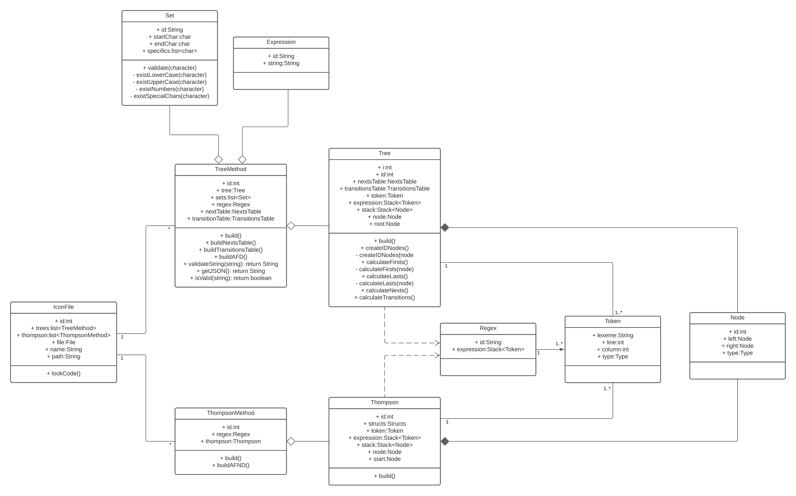

# EXREGAN
## Manual Técnico

## Índice

1. [Análisis Léxico](#1-análisis-lexico)
2. [Análisis Sintáctico](#2-análisis-sintáctico)
3. [Método Del Árbol](#3-método-del-árbol)
4. [Cálculo De Siguientes](#4-cálculo-de-siguientes)
5. [Cálculo De Transiciones](#5-cálculo-de-transiciones)
6. [Método De Thompson](#6-método-de-thompson)
7. [Diagrama De Clases](#7-diagrama-de-clases)

## 1. Análisis Léxico
* ### Tabla de Tokens
    |Descripción|Patrón|Expresión Regular|Ejemplo|Nombre de Token|
    |-----------|------|-----------------|-------|---------------|
    |Reservada CONJ|Palabra CONJ|CONJ|CONJ|RW_CONJ|
    |Caracteres Alfabéticos|Caracter a, b, c, ..., x, y, z, A, B, C, ..., X, Y, Z|[a-zA-Z]|a, c, D, E|CHAR|
    |Caracteres Numéricos|Caracter 0, 1, 2, 3, 4, 5, 6, 7, 8, 9|[0-9]|0, 4, 6, 3|CHARNUM|
    |Identificadores|Secuencia de Caracteres Alfanuméricos|[a-zA-Z][a-zA-Z0-9\_]*|cadena, num_pares, expresion_5|ID|
    |Cadenas entre Comillas|Secuencia de Caracteres Alfanuméricos entre Comillas|\\"(([^\\"\\\\]?\|\\\\.)*)\\"|"Proyecto1 OLC1", "H", "c"|STRING|
    |Llave de Apertura|Caracter \{|\{|\{|LBRACKET|
    |Llave de Cierre|Caracter \}|\}|\}|RBRACKET|
    |Punto y Coma|Caracter ;|;|;|SEMICOLON|
    |Dos Puntos|Caracter :|:|:|COLON|
    |Coma|Caracter ,|,|,|COMMA|
    |Operador Or|Caracter \||\||\||OR|
    |Cerradura Positiva|Caracter +|+|+|POSITIVE|
    |Cerradura de Kleene|Caracter *|*|*|KLEENE|
    |Opcional|Caracter ?|?|?|OPTIONAL|
    |Concatenación|Caracter .|.|.|CONCAT|
    |Virgulilla|Caracter ~|~|~|TILDE|
    |Caracter de Escape Comilla|Caracter \\"|\\\\\\"|\\"|DOUBLEQUOTE|
    |Caracter de Escape Comilla Simple|Caracter \\'|\\\\\\'|\\'|SINGLEUOTE|
    |Caracter de Escape Salto de Línea|Caracter \\n|\\\\n|\\n|ENTER|
    |Delimitador|Secuencia de caracteres %%|%%|%%|LIMIT|
    |Prompt (Flecha)|Secuencia de Caracteres ->|(\\-[\s]*\\>)|->, - >, -  >|PROMPT|
    |Caracteres Especiales ASCII 33 al 125 excluyendo Caracteres Alfanuméricos|Caracteres !, ", #, ..., {, \|, }|[!-\\/:-@\\[-`{-\\}]|@, [, ], -, \|, +|CHAR|
    |Comentarios Simples|Secuencia de Caracteres precedida de //|\\/\\/([^\r\n]*)?|// comentario simple
    |Comentarios Multilíneas|Secuencia de Caracteres entre <! y !>|\\<\\!([^<!>]*)?\\!\\>|<! comentario multilínea !>|

[Subir](#exregan)

## 2. Análisis Sintáctico
* ### Expresion Regular en Notación Polaca
    Los operadores se escriben antes que los operandos.
    <br>Ejemplo:<br>
    * | operando operando
    * . operando operando
    * \+ operando
    * \* operando
    * ? operando

* ### Gramática Libre del Contexto
```java
INI ->
    '{' CODE '}' |
    '{' '}'

CODE -> 
    DECLARATIONS '%%' EVALUATIONS |
    DECLARATIONS '%%'             |
    DECLARATIONS                  |
    '%%' EVALUATIONS              |
    '%%'

DECLARATIONS ->
    DECLARATIONS DECLARATION |
    DECLARATION

DECLARATION ->
    'CONJ' ':' TK_id '->' ELEMENTS ';' |
    TK_id '->' OPERATION ';'

ELEMENTS ->
    TK_char '~' TK_char |
    SPECIFIC

SPECIFIC ->
    SPECIFIC ',' TK_char |
    TK_char

OPERATION ->
    '.' OPERATION OPERATION |
    '|' OPERATION OPERATION |
    '*' OPERATION           |
    '+' OPERATION           |
    '?' OPERATION           |
    OPERAND

OPERAND ->
    '{' TK_id '}' |
    TK_str

EVALUATIONS ->
    EVALUATIONS EVALUATION |
    EVALUATION

EVALUATION -> TK_id ':' TK_str ';'
```

[Subir](#exregan)

## 3. Método Del Árbol
1. ### Construcción del Árbol
    Implementación en Java: Se implementó haciendo uso de pilas ya que las expresiones regulares en notación prefija se leen de derecha a izquierda para su interpretación y un árbol binario para formar la estructura del árbol.<br><br>
    Se hace uso de la clase Node para la construcción del árbol:
    ```java
    ArrayList<Integer> firsts = new ArrayList<>();
    ArrayList<Integer> lasts = new ArrayList<>();
    ArrayList<Integer> nexts = new ArrayList<>();
    boolean anulable;
    int i;
    int id;
    Node left;
    Node parent;
    Node right;
    String value;
    Type type;
    Type type1;
    public Node(int id,String value,Type type) {
        this.id = id;
        this.value = value;
        this.type = type;
    }
    public Node(int id,String value,Type type,Type type1) {
        this.id = id;
        this.value = value;
        this.type = type;
        this.type1 = type1;
    }
    ```

    Condiciones para cálculo de anulables:
    |Terminal|Anulabilidad|
    |--------|-----------|
    |C<sub>1</sub> *|Anulable|
    |C<sub>1</sub> +|(Anulable(C<sub>1</sub>)) ? Anulable : No Anulable|
    |C<sub>1</sub> ?|Anulable|
    |C<sub>1</sub> \| C<sub>2</sub>|(Anulable(C<sub>1</sub>) \|\| Anulable(C<sub>2</sub>)) ? Anulable : No Anulable|
    |C<sub>1</sub> C<sub>2</sub>|(Anulable(C<sub>1</sub>) && Anulable(C<sub>2</sub>)) ? Anulable : No Anulable|

    Se construyó el árbol desde que se analiza sintáctiamente cada token y en el que se calculan los atributos como etiquetas y anulabilidades:

    ```java
    {:
        private void addTree(String regex,Node op) {
            Node root = new Node(this.id + 1,".",Type.CONCAT);
            root.left = op;
            root.right = new Node(this.id,"#",Type.LEAF,Type.END);
            root.right.anulable = false;
            root.right.i = this.leaf;
            root.anulable = root.left.anulable && root.right.anulable;
            regexs.put(regex,root);
            this.id = 0;
            this.leaf = 1;
        }
    :}

    DECLARATION ::=
        IDS:regex TK_prompt OPERATION:op TK_semicolon                   {:addTree(regex,op);:} ;

    OPERATION ::=
        TK_or       OPERATION:op1 OPERATION:op2 {:RESULT = buildTree("|",op1,op2,op1.anulable || op2.anulable,Type.OR);    :} |
        TK_concat   OPERATION:op1 OPERATION:op2 {:RESULT = buildTree(".",op1,op2,op1.anulable && op2.anulable,Type.CONCAT);:} |
        TK_kleene   OPERATION:op1               {:RESULT = buildTree("*",op1,null,true,Type.KLEENE);                       :} |
        TK_positive OPERATION:op1               {:RESULT = buildTree("+",op1,null,op1.anulable,Type.POSITIVE);             :} |
        TK_optional OPERATION:op1               {:RESULT = buildTree("?",op1,null,true,Type.OPTIONAL);                     :} |
        OPERAND:op                              {:RESULT = op;                                                             :} ;

    OPERAND ::=
        TK_lbr TK_id:op TK_rbr     {:RESULT = buildTree(op,Type.LEAF,Type.ID);         :} |
        TK_str      :op            {:RESULT = buildTree(op,Type.LEAF,Type.STRING);     :} |
        TK_newline  :op            {:RESULT = buildTree(op,Type.LEAF,Type.ENTER);      :} |
        TK_singlequ :op            {:RESULT = buildTree(op,Type.LEAF,Type.SINGLEQUOTE);:} |
        TK_doublequ :op            {:RESULT = buildTree(op,Type.LEAF,Type.DOUBLEQUOTE);:} ;
    ```

    [Subir](#exregan)

2. ### Cálculo de Primeras Posiciones
    Conciciones para los cálculos:
    |Terminal|Primeras Posiciones|
    |--------|-----------|
    |C<sub>1</sub> *|Primeros(C<sub>1</sub>)|
    |C<sub>1</sub> +|Primeros(C<sub>1</sub>)|
    |C<sub>1</sub> ?|Primeros(C<sub>1</sub>)|
    |C<sub>1</sub> \| C<sub>2</sub>|Primeros(C<sub>1</sub>) U Primeros(C<sub>2</sub>)|
    |C<sub>1</sub> C<sub>2</sub>|(Anulable(C<sub>1</sub>)) ? Primeros(C<sub>1</sub>) U Primeros(C<sub>2</sub>) : Primeros(C<sub>1</sub>)|

    Métodos implementados para el cálculo:
    ```java
    public void calculateFirsts() {
        calculateFirsts(root);
    }
    private void calculateFirsts(Node node) {
        if(node != null) {
            if(node.type == Type.LEAF) {
                node.firsts.add(node.i);
                return;
            }
            calculateFirsts(node.left);
            calculateFirsts(node.right);
            node.firsts.addAll(node.left.firsts);
            if(node.type == Type.OR) {
                node.firsts.addAll(node.right.firsts);
            }
            else if(node.type == Type.CONCAT) {
                if(node.left.anulable) {
                    node.firsts.addAll(node.right.firsts);
                }
            }
        }
    }
    ```

    [Subir](#exregan)

3. ### Cálculo de Últimas Posiciones
    Conciciones para los cálculos:
    |Terminal|Últimas Posiciones|
    |--------|-----------|
    |C<sub>1</sub> *|Últimos(C<sub>1</sub>)|
    |C<sub>1</sub> +|Últimos(C<sub>1</sub>)|
    |C<sub>1</sub> ?|Últimos(C<sub>1</sub>)|
    |C<sub>1</sub> \| C<sub>2</sub>|Últimos(C<sub>1</sub>) U Últimos(C<sub>2</sub>)|
    |C<sub>1</sub> C<sub>2</sub>|(Anulable(C<sub>2</sub>)) ? Últimos(C<sub>1</sub>) U Últimos(C<sub>2</sub>) : Últimos(C<sub>2</sub>)|
    Métodos implementados para el cálculo:
    ```java
    public void calculateLasts() {
        calculateLasts(root);
    }
    private void calculateLasts(Node node) {
        if(node != null) {
            if(node.type == Type.LEAF) {
                node.lasts.add(node.i);
                return;
            }
            calculateLasts(node.left);
            calculateLasts(node.right);
            if(node.type == Type.OR || node.type == Type.POSITIVE || node.type == Type.KLEENE || node.type == Type.OPTIONAL) {
                node.lasts.addAll(node.left.lasts);
                if(node.type == Type.OR) {
                    node.lasts.addAll(node.right.lasts);
                }
            }
            else if(node.type == Type.CONCAT) {
                if(node.right.anulable) {
                    node.lasts.addAll(node.left.lasts);
                }
                node.lasts.addAll(node.right.lasts);
            }
        }
    }
    ```

    [Subir](#exregan)

## 4. Cálculo De Siguientes
Conciciones para los cálculos:<br>
|Terminal|Siguientes Posiciones C<sub>1</sub>|
|--------|-----------|
|C<sub>1</sub> *|Primeros(C<sub>1</sub>)|
|C<sub>1</sub> +|Primeros(C<sub>1</sub>)|
|C<sub>1</sub> ?||
|C<sub>1</sub> \| C<sub>2</sub>||
|C<sub>1</sub> C<sub>2</sub>|Primeros(C<sub>2</sub>)|

Método implementado desde la clase Tree:
```java
public void calculateNexts() {
    nexts = new NextsTable(root);
    nexts.calculateNexts();
}
```
Clase NextTable.
```java
class NextsTable {
    Map<Integer,Node> leafs;
    Node root;
    public NextsTable(Node root) {
        this.root = root;
        this.leafs = new TreeMap<>();
    }
    public void calculateNexts() {
        fillLeafs(root);
        calculateNexts(root);
    }
    private void calculateNexts(Node node) {
        if(node != null) {
            if(node.type == Type.LEAF) return;
            if(node.type == Type.CONCAT) {
                for(int last : node.left.lasts) {
                    leafs.get(last).nexts.addAll(node.right.firsts);
                    leafs.get(last).nexts.sort(null);
                }
            }
            else if(node.type == Type.KLEENE || node.type == Type.POSITIVE) {
                for(int last : node.left.lasts) {
                    leafs.get(last).nexts.addAll(node.left.firsts);
                    leafs.get(last).nexts.sort(null);
                }
            }
            calculateNexts(node.left);
            calculateNexts(node.right);
        }
    }
    private void fillLeafs(Node node) {
        if(node != null) {
            if(node.type == Type.LEAF) {
                leafs.put(node.i,node);
                return;
            }
            fillLeafs(node.left);
            fillLeafs(node.right);
        }
    }
}
```

[Subir](#exregan)

## 5. Cálculo De Transiciones
Método implementado desde la clase Tree:
```java
public void calculateTransitions() {
    transitions.add(new Transition(0,"",new HashSet<Integer>(root.firsts)));
    table = new TransitionTable(transitions,nexts.leafs);
    table.build();
    for(Transition transition : table.transitions) {
        if(transition.nexts.contains(root.right.i)) {
            transition.accept = true;
        }
    }
}
```
Se implementó la clase TransitionTable.
```java
class TransitionTable {
    Map<Integer,Node> nexts = new TreeMap<>();
    ArrayList<Transition> transitions = new ArrayList<>();
    ArrayList<Transition> tmpTrnst = new ArrayList<>();
    ArrayList<Terminal> terminals = new ArrayList<>();
    public TransitionTable(ArrayList<Transition> transitions,Map<Integer,Node> nexts) {
        this.transitions = transitions;
        this.nexts = nexts;
    }
    public void build() {
        addTerminals();
        build(0);
    }
    private void build(int i) {
        if(i < transitions.size()) {
            int position;
            Node next;
            Transition newTrnst;
            Transition transition = transitions.get(i);
            for(Terminal terminal : terminals) {
                newTrnst = new Transition(transitions.size(),terminal.value);
                for(int nxt : transition.nexts) {
                    next = nexts.get(nxt);
                    if(next.value.equals(terminal.value)) {
                        newTrnst.nexts.addAll(next.nexts);
                    }
                }
                position = existTransition(newTrnst);
                if(position == -1) {
                    if(newTrnst.nexts.size() > 0) {
                        transition.changes.put(terminal.value,new Change(transitions.size(),terminal.value,terminal.type));
                        transitions.add(newTrnst);
                    }
                }
                else {
                    transition.changes.put(terminal.value,new Change(position,terminal.value,terminal.type));
                }
            }
            build(i + 1);
        }
    }
    private int existTransition(Transition transition) {
        for(int i = 0; i < transitions.size(); i ++) {
            if(transitions.get(i).nexts.equals(transition.nexts)) {
                return i;
            }
        }
        return -1;
    }
    private void addTerminals() {
        Terminal newTerminal;
        for(Map.Entry<Integer,Node> next : nexts.entrySet()) {
            if(!next.getValue().value.equals("#")) {
                newTerminal = new Terminal(next.getValue().value,next.getValue().type1);
                if(!verifyTerminal(newTerminal)) {
                    terminals.add(newTerminal);
                }
            }
        }
    }
    private boolean verifyTerminal(Terminal newTerminal) {
        for(Terminal terminal : terminals) {
            if(terminal.value.equals(newTerminal.value)) {
                return true;
            }
        }
        return false;
    }
}
```

[Subir](#exregan)

## 6. Método De Thompson
* Construcción de AFND.<br>
    Se hace uso de la clase State para construir el autómata.
    ```java
    class State {
        boolean accept;
        boolean enumered;
        int number;
        State next1;
        State next2;
        State exit;
        State last;
        State jmps;
        String id;
        String value;
        public State() {}
        public State(String id,String value) {
            this.id = id;
            this.value = value;
        }
        public String toString() {
            return id + " - " + value;
        }
    }
    ```
    Se hace uso de la clase Structs para construir la estructura correspondiente a las operaciones Or, Concatenación, Positiva, Kleene y Opcional.
    * Or
        ```java
        public State OR(String id,State frst,State scnd) {
            State state = new State(id + "_start","&epsilon;");
            State exit = new State(id + "_exit",state.value);
            //or1
            state.next1 = frst;
            state.last = state.next1.last.exit = exit;
            //or2
            state.next2 = scnd;
            state.next2.last.next1 = exit;
            return state;
        }
        ```
    * Concatenación
        ```java
        public State CONCAT(String id,State frst,State scnd) {
            State state = new State(id + "_start","&epsilon;");
            //and1
            state = frst;
            //and2
            state.last.next1 = scnd.next1;
            state.last.next2 = scnd.next2;
            if(scnd.jmps != null) {
                state.last.jmps = scnd.jmps;
            }
            state.last = scnd.last;
            return state;
        }
        ```
    * Positiva
        ```java
        public State POSITIVE(String id,State frst) {
            State state = new State(id + "_start","&epsilon;");
            state.next1 = frst;
            state.next1.last.jmps = state.next1;
            state.last = state.next1.last.next1 = new State(id + "_exit",state.value);
            return state;
        }
        ```
    * Kleene
        ```java
        public State KLEENE(String id,State frst) {
            State state = new State(id + "_start","&epsilon;");
            state.next1 = frst;
            state.next1.last.jmps = state.next1;
            state.jmps = state.last = state.next1.last.next1 = new State(id + "_exit",state.value);
            return state;
        }
        ```
    * Opcional
        ```java
        public State OPTIONAL(String id,State frst) {
            State state = new State(id + "_start","&epsilon;");
            state.next1 = frst;
            state.jmps = state.last = state.next1.last.next1 = new State(id + "_exit",state.value);
            return state;
        }
        ```
    * Terminal
        ```java
        public State SIMPLE(String id,Node frst) {
            State start = new State(id,"&epsilon;");
            start.last = start.next1 = new State(id + "_next1",frst.value);
            return start;
        }
        ```
    * Epsilon
        ```java
        public State EPSILON(String id) {
            State start = new State(id,"&epsilon;");
            start.last = start.next1 = new State(id + "_next1",start.value);
            return start;
        }
        ```
    Se implementó el método build de la clase Thompson
    ```java
    public class Thompson {
        private int id;
        private State start;
        private Structs structs;
        private Node tree;
        public Thompson() {}
        public Thompson(Node tree) {
            this.id = 0;
            this.structs = new Structs();
            this.tree = tree;
        }
        public void build() {
            start = build1(tree.left);
            start.last.accept = true;
        }
        public State build1(Node node) {
            id ++;
            switch(node.type) {
                case OR:
                    return structs.OR(String.valueOf(id),build1(node.left),build1(node.right));               
                case CONCAT:
                    return structs.CONCAT(String.valueOf(id),build1(node.left),build1(node.right));
                case POSITIVE:
                    return structs.CONCAT(String.valueOf(id),build1(node.left),structs.KLEENE(String.valueOf(id) + "_c",build1(node.left)));
                case KLEENE:
                    return structs.KLEENE(String.valueOf(id),build1(node.left));
                case OPTIONAL:
                    return structs.OR(String.valueOf(id),build1(node.left),structs.EPSILON(String.valueOf(id) + "_epsilon"));
                default:
                    return structs.SIMPLE(String.valueOf(id),node);
            }
        }
        public State build2(Node node) {
            id ++;
            switch(node.type) {
                case OR:
                    return structs.OR(String.valueOf(id),build2(node.left),build2(node.right));               
                case CONCAT:
                    return structs.CONCAT(String.valueOf(id),build2(node.left),build2(node.right));
                case POSITIVE:
                    return structs.POSITIVE(String.valueOf(id),build2(node.left));
                case KLEENE:
                    return structs.KLEENE(String.valueOf(id),build2(node.left));
                case OPTIONAL:
                    return structs.OPTIONAL(String.valueOf(id),build2(node.left));
                default:
                    return structs.SIMPLE(String.valueOf(id),node);
            }
        }
    }
    ```

    [Subir](#exregan)

## 7. Diagrama De Clases


[Subir](#exregan)