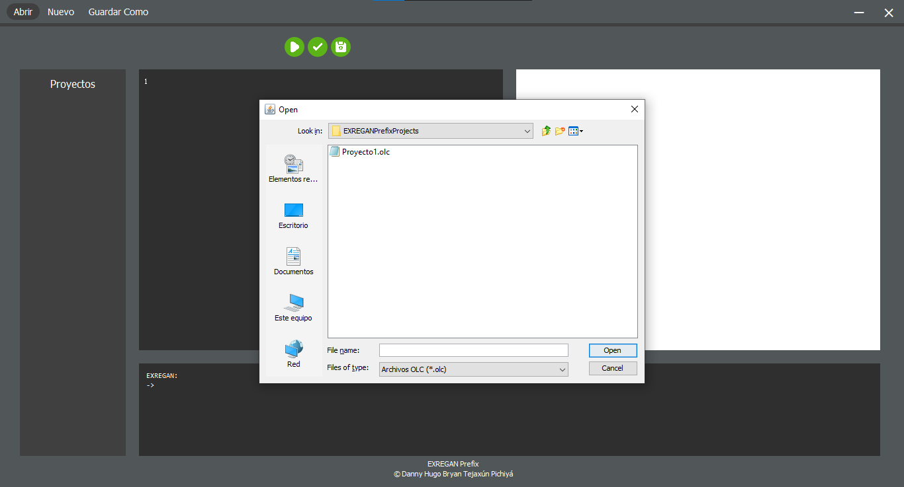
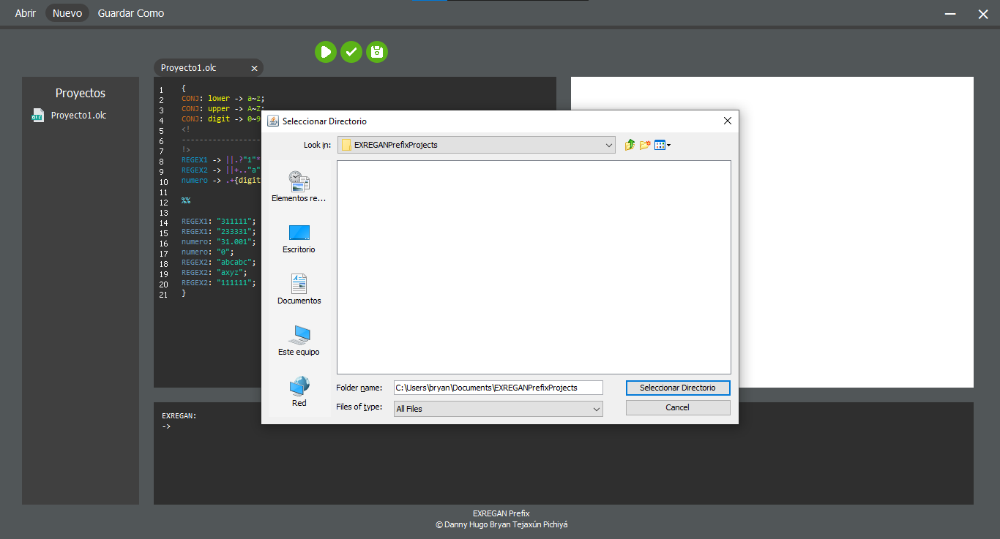
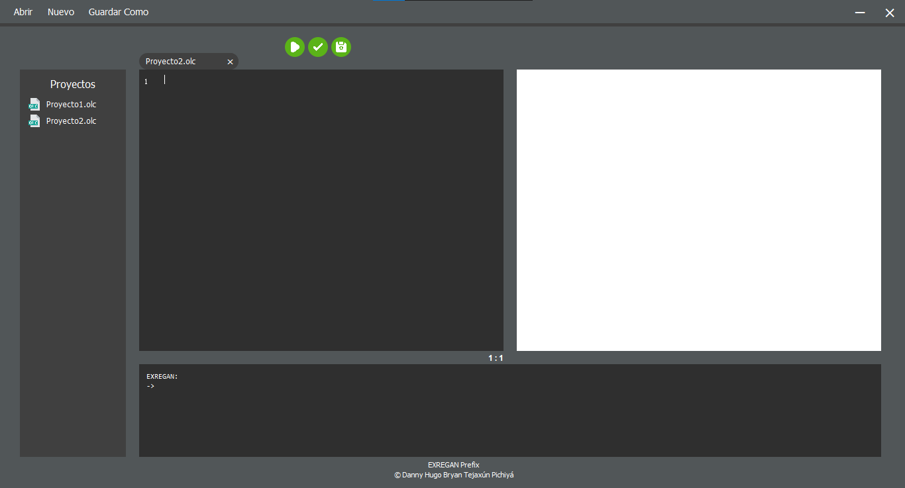

# EXREGAN
## Manual de Usuario

## Índice

1. [Opciones Para Archivos](#1-opciones-para-archivos)
    1. [Abrir Archivo](#abrir-archivo)
    2. [Nuevo Archivo](#nuevo-archivo)
    3. [Guardar Como](#guardar-como)
2. [Opciones Para Entradas](#2-opciones-para-entradas)
    1. [Analizar Entrada](#analizar-entrada)
    2. [Validar Cadenas](#validar-cadenas)
    3. [Guardar](#guardar)
3. [Grafos Y Tablas](#3-grafos-y-tablas)
    1. [Árbol de Expresión](#árbol-de-expresión)
    2. [Tabla de Siguientes](#tabla-de-siguientes)
    3. [Tabla de Transiciones](#tabla-de-transiciones)
    4. [AFD](#afd)
    5. [AFND](#afnd)
4. [Reporte De Errores](#4-reporte-de-errores)
5. [Expresion Regular: Notación Prefija O Polaca](#5-expresión-regular)
6. [Sintaxis del Lenguaje](#6-sintaxis-del-lenguaje)

## 1. Opciones Para Archivos
* ### Abrir Archivo
    * Buscar el directorio donde se encuentra el archivo.
    

    * Seleccionar el archivo para abrirlo y se mostrará en el editor de código.
    

* ### Nuevo Archivo
    * Seleccionar el directorio.
    

    * Nombrar el archivo y aceptar.
    

    * Al crearlo se abrirá el archivo en blanco en el editor de código.
    

* ### Guardar Como
    * Seleccionar el directorio en el que se guardará el nuevo archivo.
    

    * Nombrar el archivo y aceptar.
    

    * Al crearlo se abrirá el archivo con código en el editor de código.
    

[Subir](#exregan)

## 2. Opciones Para Entradas
* ### Analizar Entrada
    Mostrará el resultado en consola y generará automáticamente los autómatas y los grafos.
    [Ver Grafos y Tablas](#3-grafos-y-tablas).
    

* ### Validar Cadenas
    Mostrará el resultado en consola y generará un archivo de salida en formato JSON.
    

    * Salida.<br>
    

* ### Guardar
    Actualiza el archivo con el código modificado en el editor de código.
    

[Subir](#exregan)

## 3. Grafos Y Tablas
* ### Árbol de Expresión
    Árbol construido mediante Método del Árbol. Cálculos realizados:
    1. Anulables.
    2. Primeras posiciones.
    3. Últimas posiciones.

    

* ### Tabla de Siguientes
    

* ### Tabla de Transiciones
    

* ### AFD
    

* ### AFND
    

[Subir](#exregan)

## 4. Reporte De Errores
El reporte se genera y abre automáticamente al momento del análisis si se detecta errores léxicos o sintácticos o ambos.


[Subir](#exregan)

## 5. Expresión Regular
* ### Expresion Regular en Notación Infija
    Los operadores se escriben antes que los operandos.
    <br>Ejemplo:<br>
    * operando | operando
    * operando . operando
    * operando \+
    * operando \*
    * operando ?
* ### Ejemplos de  Expresiones Regulares en Notación Infija
    |Notación Infija|Notación Prefija|
    |----------------|---------------|
    |((operando)* \| operando)+|+ \| * operando operando|
    |(operando)+(operando \| operando)|. + operando \| operando operando|

[Subir](#exregan)

## 6. Sintaxis Del Lenguaje

```java
{
//Conjuntos
CONJ: lower -> a~z;
CONJ: upper -> A~Z;
CONJ: digit -> 0~9;
<!
--------------COMENTARIO MULTILÍNEA--------------
!>
//Expresiones Regulares
REGEX1 -> ("1"?."2"*|"3"+."2"*)|("2"?."3"+."1"|"3"."1"*);
REGEX2 -> ("a"."b"."c")+|"a"?."x"."y"."z"|("0"|"1")+;
numero -> {digit}+.(".".{digit}+)?;

%%
//Validación de Cadenas
REGEX1: "311111";
REGEX1: "233331";
numero: "31.001";
numero: "0";
REGEX2: "abcabc";
REGEX2: "axyz";
REGEX2: "111111";
}
```

[Subir](#exregan)